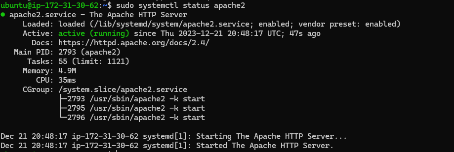

## Awesome Documentation of lamp-project

`sudo apt update`

`sudo apt install apache2`

`sudo systemctl status apache2`

-[install openssh](https://learn.microsoft.com/en-us/windows-server/administration/openssh/openssh_install_firstuse?tabs=powershell)

-[openssh-key-management](https://learn.microsoft.com/en-us/windows-server/administration/openssh/openssh_keymanagement)

`curl http://localhost:80` 

`http://<Public-IP-Address>:80` I opened a web browser of my choice and try to access the url to test how Apache HTTP server can respond to requests from the Internet

-[Alternative-method-of-getting-public-ip](curl -s http://169.254.169.254/latest/meta-data/public-ipv4) 

`sudo apt install mysql-server`

`sudo mysql`

`ALTER USER 'root'@'localhost' IDENTIFIED WITH mysql_native_password BY 'PassWord.1';`

`sudo mysql_secure_installation`

`sudo mysql -p`

`sudo apt install php libapache2-mod-php php-mysql`

`sudo mkdir /var/www/projectlamp`

`sudo chown -R $USER:$USER /var/www/projectlamp`

`sudo vi /etc/apache2/sites-available/projectlamp.conf`

`sudo ls /etc/apache2/sites-available`

`sudo a2ensite projectlamp`

` sudo a2dissite 000-default`

` sudo apache2ctl configtest`

` sudo systemctl reload apache2`

` sudo sh -c 'echo "Hello LAMP from hostname $(curl -s http://169.254.169.254/latest/meta-data/p
ublic-hostname) with public IP $(curl -s http://169.254.169.254/latest/meta-data/public-ipv4)" > /var/www/projectlamp/index.html'`

`sudo systemctl reload apache2`

`sudo vi /etc/apache2/mods-enabled/dir.conf`

`sudo systemctl reload apache2`

`sudo vi /var/www/projectlamp/info.php`

`http://`server_domain_or_IP`/info.php` [pasted on browser]

`sudo rm /var/www/your_domain/info.php`

`CREATE DATABASE `example_database`;`

`CREATE USER 'example_user'@'%' IDENTIFIED WITH mysql_native_password BY 'PassWord.2';`

`GRANT ALL ON example_database.* TO 'example_user'@'%';`

`SHOW DATABASES;`

`SELECT * FROM example_database.todo_list;`

`sudo vi /var/www/projectlamp/todo_list.php`